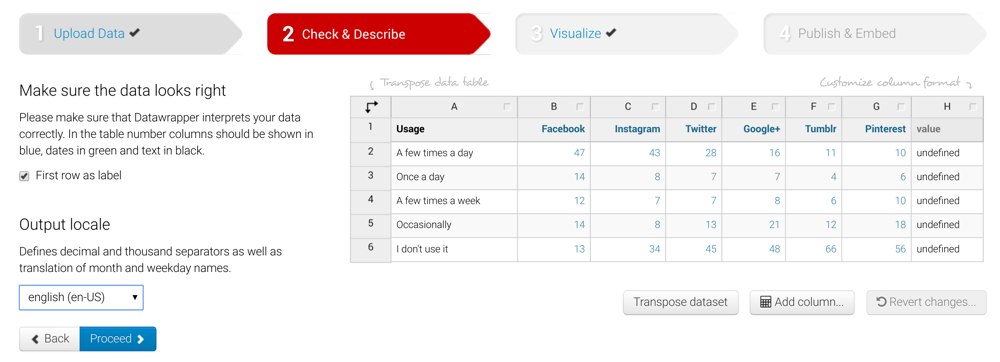
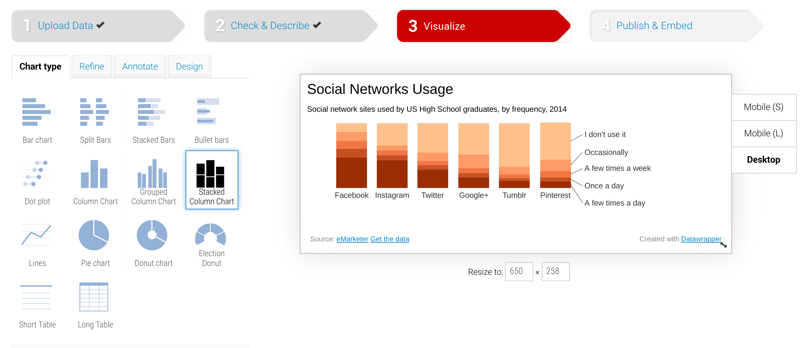

KIT DE CIBERACTIVISMO SOCIAL
============================

# Índice

* [Cómo construir infografías](https://enredacoop.github.io/kit-ciberactivismo-social#como-construir-infografas)
* [Técnicas de recolección de información](https://enredacoop.github.io/kit-ciberactivismo-social#Tcnicas-de-recoleccin-de-informacin)

# Técnicas de recolección de información

## Tipi Ciudadano

Próximamente...

## Google Alerts

Las Alertas de Google es un servicio de supervisión de los contenidos, que ofrece el motor de búsqueda de la compañía Google, que automáticamente notifica al usuario cuando el nuevo contenido coincide con un conjunto de términos de búsqueda seleccionados por el usuario. (Wikipedia)

### Posibles usos

* Monitorizar cualquier mención a nuestra organización
* Buscar referencias a una campaña que hayamos lanzado
* Medir la difusión de nuestros contenidos
* Recibir las novedades sobre un tématica de sitios webs de referencia
* Monitorizar la actividad en Redes Sociales 

### Configuración básica

* La frecuencia con la que recibes notificaciones
* Las fuentes donde realizará las busquedas (Noticias, Web, Blogs, vídeos, libros o foros)
* El idioma
* La zona del mundo de la que quieres recibir información (por paises)
* El número de resultados que quieres ver (Todos, o solo los más destacados)
* Las cuentas que reciben la alerta: Puedes rebirlo en tu mail o en un lector RSS

### Comandos para afinar nuestras busquedas

* " ": Para buscar una algo literalmente > "economia social" "la transicionera" (los artículos son exluidos de la búsqueda sino están entre comillas)

* -: Para excluír de la busqueda los resultados que incluyan un término concreto> cooperativo -deporte

* OR (ó |): Permite agrupar busquedas, incluyendo páginas que contengan un término u otro> Manifestación TTIP Málaga OR Sevilla OR Granada

* *: Comodín. Utilizado para sustituir una palabra en las busquedas de frases exactas (las que usan "")> 

* Site: busca en webs especificas> pobreza site:pp.es OR site:psoe.es  OR site:podemos.info OR site:ciudadanos.es

* intitle: limita las busquedas de las palabras al titulo de la página > site:eldiario.es OR site:publico.es intitle:tercer sector

# Como construir infografías

## Por qué infografías

Vivimos en la era de los datos, rodeados de ellos y cada va a más. Por otro no solemos sacarle valor a los mismos, ni de forma interna en las organizaciones para medir evoluciones o proyectos ni de forma externa para comunicar mejor. Y es que las infografías son un gran recurso comunicativo (o pieza comunicativa) cuando se desea hacer resúmenes o agregados de cierta información.

Se trabajarán las visualizaciones desde una perspectiva eminentemente práctica con el objetivo de poder usarlas mañana mismo, aunque con ello se pierda la introducción téorica a veces necesarioa.

## El trabajo de preparación de los datos

Existen diferentes formas de trabajar con los datos con el objetivo de prepararlos para la visualización. Eso si, las tareas están bien definidas: limpieza, unificar criterios, ordenación, agrupamientos, etc. Este tipo de tareas para personas con conocimientos técnicos medios se las facilita mucho as hojas de cálculo.

Las hojas de cálculo son un tipo de documento que nos permiten manipular datos numéricos y/o alfanuméricos.
* La representación de los datos se realiza en forma de filas y columnas (formato tabular) lo que hacer que cada dato esté dispuesto en una celda (conexión entre fila y columna).
Cada celda puede contener un valor numérico, alfanumérico o una fórmula que opere con los valores de otras celdas.
Debido a estas cuestiones, el uso de las hojas de cálculo está muy extendido en todas las áreas ya que permiten un trabajo simple/medio/complejo con los datos para obtener resultados de forma rápida y automatizada.
Existen ciertos formatos (ods, xls, ...) propios de los diferentes tipos de software de gestión de hojas de cálculo  pero se recomienda el uso del formato CSV (valores separados por comas) para la exportación de los mismos una vez que se ha realizado el trabajo con ellos.
Dado el formato tabular de las hojas de cálculo es automático transformar un documento en su análogo CSV, el cual perderá todo el estilo y solo conservará los datos.
En un formato CSV cada fila representa una fila de la hoja de cálculo y cada columna se representa por su valor más una coma indicando que termina una columna y empieza otra.

Para la tabla

| Paises    | Población | Área (km2) | Capital |
|---|-------|-----------|------------|---------|
| España    | 46704314  | 504645     | Madrid  |
| Portugal  | 10427301  | 92212      | Lisboa  |
| Italia    | 60782668  | 301338     | Roma    |

su correspondencia CSV sería

<pre>
Paises, Población, Área (km2), Capital
España, 46704314, 504645, Madrid
Portugal, 10427301, 92212, Lisboa
Italia, 60782668, 301338, Roma    |
</pre>

Todo software de hojas de cálculo puede abrir sin problemas los ficheros CSV y presentarlos en formato tabular para su posterior procesamiento.
Para obtener un fichero CSV de una hoja de cálculo basta con abrir dicha hoja de cálculo con el software que se use y guardarla como “CSV” en la opción determinada del programa. Con ello se obtiene una copia estandarizada de los datos en un formato abierto.
Nuestro objetivo no es indagar en el funcionamiento de las hojas de cálculo pero sí se valoró como necesario el presentarlas dado el amplio uso que de ellas se realiza en diferentes ámbitos como forma de mostrar y operar con conjuntos de datos.

## De los datos a las visualizaciones

Para la inmensa mayoría de los seres humanos la comprensión de los datos se simplifica aplicando sobre ellos diversas técnicas de visualización de los mismos, tanto para facilitar su entendimiento como para destacar alguna característica o elemento diferenciador oculto en cierto conjunto de datos.
de la estadística en particular y desde la ciencia matemática en general siempre se ha tendido a realizar representaciones gráficas de conceptos abstractos difícilmente entendibles sin dichas gráficas.
Es por ello que el campo de las representaciones gráficas de números (datos) siempre ha tenido una gran importancia tanto en su uso como en su investigación.
Con la irrupción de la Era del Dato en la que actualmente nos encontramos dentro de la Sociedad de la Información, en donde toda entidad del sistema genera datos sin cesar, el estudio de las representaciones gráficas de los datos ha experimentado un tremendo auge y no son pocas las posibilidades con las que se cuenta.
A continuación se verán algunas posibilidades, desde las clásicas hasta las más actuales en la red.

* Gráfico de barras (bar chart): Consta de dos ejes y representa en en Y los elementos a medir (agrupados o no) y en el eje X el valor medido.
* Gráfico de columnas (column chart): Consta de dos ejes y representa en en X los elementos a medir (agrupados o no) y en el eje Y el valor medido.
* Gráfico de tarta o donut (pie/donut chart): Representa de forma circular los porcentajes del elemento a medir en torno al total que es la tarda/donut completo.
* Gráfica de dispersión (scatter plot/chart): Basado en el sistema cartesiano, permite representar los valores de dos variables para un conjunto de datos. Los datos se muestran como una colección de puntos tomando valores en el eje vertical (variable1) como en el horizontal (variable2).
* Circle packing: Círculos anidados que permiten representar jerarquías y comparar los valores. Esta visualización es particularmente eficaz para mostrar la proporción entre los elementos a través de sus áreas y su posición dentro de una estructura jerárquica.
* Treemap: Permite representar las jerarquías de datos y la proporción entre los elementos. Los diferentes niveles jerárquicos crean agrupaciones visuales a través de la subdivisión en rectángulos en proporción al valor de cada elemento. Estas visualizaciones son útiles para representar las diferente proporciones de estructuras de datos jerárquicos anidados.
* Gráfico de barras apiladas (stacked bars graph): Similar a los gráficos de columnas pero en el eje Y se muestran valores de una variable agrupados en torno a una categoría. El objetivo de la visualización es intenta comparar las partes de un todo.
* Gráfico de flujo (stream graph): Visualización muy recomendable para datos continuos tales como series temporales (en lugar de usar barras apiladas).

Para la creación de las visualizaciones se usarán dos aplicaciones web, por lo que no serán necesario instalar ningún software en los equipos personales.

Las aplicaciones web son:

* [DataWrapper](http://datawrapper.de)
* [Raw Graphs](http://rawgraphs.io)

Antes de empezar con algunos ejemplos de uso de las herramientas comentadas sería conveniente identificar algunos aspectos comunes de toda herramienta de creación de visualizaciones.
Básicamente siempre se pueden diferenciar 3 apartados fundamentales: inserción de datos, configuración y adaptación, y exportación de la visualización.

**Inserción de datos**

Se trata de introducir los datos que servirán de materia prima al sistema para la creación de la visualización.
Pueden existir diversas formas de inserción de datos pero las más comunes son mediante texto (formato CSV) o mediante la subida de un fichero (CSV, ODS, XLS, etc).

**Configuración y adaptación**

Una vez cargados los datos se deberá elegir la gráfica que mejor represente el conjunto de datos con el que se trabaja. Además de ello hay que definir las variables a mostrar, los colores en los que se visualizarán, los textos y algunas cuestiones más.

**Exportación**

Finalizada la visualización es tiempo de exportarla para usarla en otros entornos, ya sea obteniendo la imagen resultante u obteniendo su código embebido (código HTML) para ser integrada en otras webs.

Vistas estas tres secciones de trabajo bastante común en este tipo de herramientas pasamos a mostrar, mediante ejemplos, cada una de las aplicaciones webs comentadas previamente para realizar las visualizaciones de los datos.

### Data Wrapper

Data Wrapper es una herramienta web libre y gratuita desarrollada por ABZV (Instituto alemán de formación en periodismo) para realizar visualizaciones de datos. Estas visualizaciones cuentan además con ciertas interacciones qe se pueden definir en la herramienta.
Al igual que RAW, el ser libre la convierte en una herramienta altamente configurable y modifcable.

**Inserción de datos**

Esta sección está preparada para que copies el contenido de un fichero CSV o directamente de una hoja de cálculo en la caja de texto que aparece en la interfaz.
Además permitirá subir directamente un fichero CSV de datos para operar con él.

**Configuración y adaptación**

Con los datos ya cargados es hora de revisar que todo se subió correctamente. Para ello tenemos un visualizador en modo tabla de los mismos.
Además podremos describir los datos indicando si éstos cuentan como cabecera de información en la primera fila o añadiendo nuevas columnas.

En el siguiente paso podremos seleccionar que tipo de gráfica y estilos para los datos queremos aplicar.
Junto a la selección de la gráfica podremos además afinar el resultado de la visualización y añadir campos que nos permitan contar una historia en torno a los datos que se visualizan como es añadir textos y marcar elementos como destacados (entre otras muchas opciones).

**Exportación**

En este paso final se nos permite enlazar directamente a la visualización en el sistema compartiendo en enlace que se muestra. También nos permite copiar el código HTML que genera la visualización para pegarlo directamente en otra web o blog.
Por último permite crear otra visualización duplicando la actual, facilitando así el trabajo al usuario.

### Raw Graphs

RAW Graphs es una herramienta web libre y gratuita desarrollada por Density Design Research Lab (Politécnica de Milán) para servir de puente entre hojas de cálculo y gráficas vectoriales.
Está construído usando como base D3js, una de las librerías gráficas más potentes y extendidas en el mundo web. Además el ser libre la convierte en una herramienta altamente configurable y modifcable.

**Inserción de datos**

Esta sección está preparada para que copies el contenido de un fichero CSV o directamente de una hoja de cálculo en la caja de texto que aparece en la interfaz.
Tiene dos tipos de visualización una vez copiados los datos: en modo texto y en modo tabla. Además el sistema indicará si la importación se realizó correctamente.

**Configuración y adaptación**

En el siguiente paso podremos seleccionar que tipo de gráfica o layout para los datos queremos aplicar.
El sistema nos proporciona una pequeña miniatura de ejemplo del gráfico, un texto explicativo y un enlace para ahondar en el tipo de gráfica.

Una vez marcada que tipo de gráfica se va a usar es necesario asociar algunas variables del conjunto de datos a los parámetros de la gráfica para su construcción (serie, jerarquía, tamaño, color, etiqueta, tamaño, ...)

Además se indicarán algunos parámetros de estilo adicionales tales como tamaños del gráfico y colores de los elementos a mostrar.

**Exportación**

Este es el paso final antes de poder compartir la visualización. RAW, una vez realizado el trabajo, nos permite descargarlos como imagen, como gráfico vectorial o como modelo de datos en JSON para usarlo en otra aplicación.
Además nos permite copiar el código HTML que genera la visualización para pegarlo directamente en otra web o blog.

## Insertar visualizaciones en otras web

Una vez realizado todo el trabajo será necesario publicarlo. Se pueden considerar dos tipos de formatos según lo que hemos visto:

**Imagen**

Son relativamente fáciles de integrar en una web con independencia de su formato de fichero (JPG, PNG, SVG, ...). Dependiendo del sistema que estemos usando para publicar la noticia en la que se incluirá dicha visualización puede modificarse la nomenclatura pero buscando una opción de “añadir imagen” o similar tendríamos el trabajo finalizado.

**Código embebido**

El código embebido siempre se encuentra en formato HTML (lenguaje básico de la Web). La mayoría de los sistemas de gestión de contenidos o de blogs (Drupal, Wordpress, Mezzanine, etc.) nos permiten integrar dicho código embebido como parte de la página que estemos editando por lo que copiando el código embebido y pegándolo en el cuerpo de pagina se tendría el trabajo finalizado.
